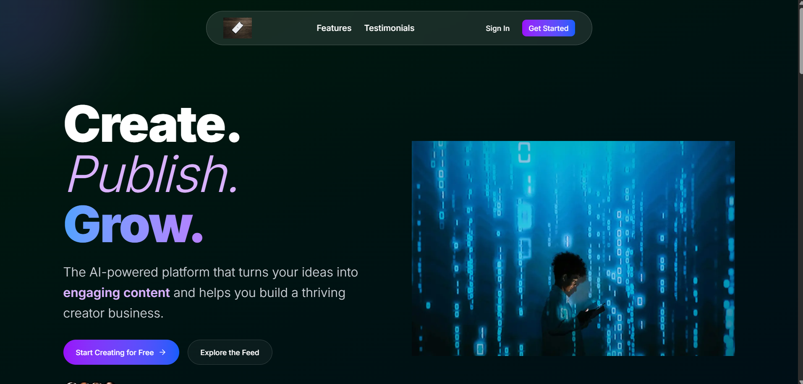
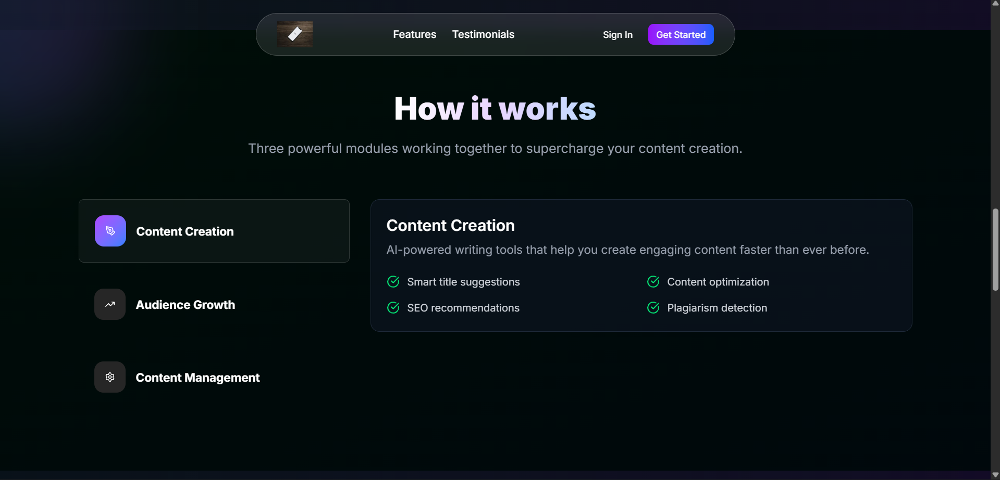
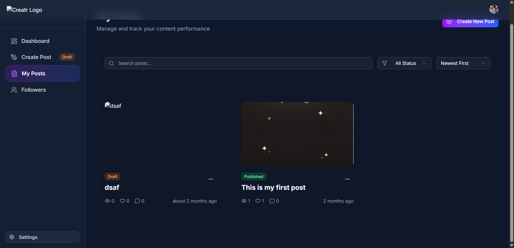
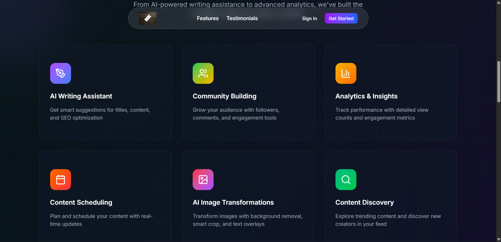
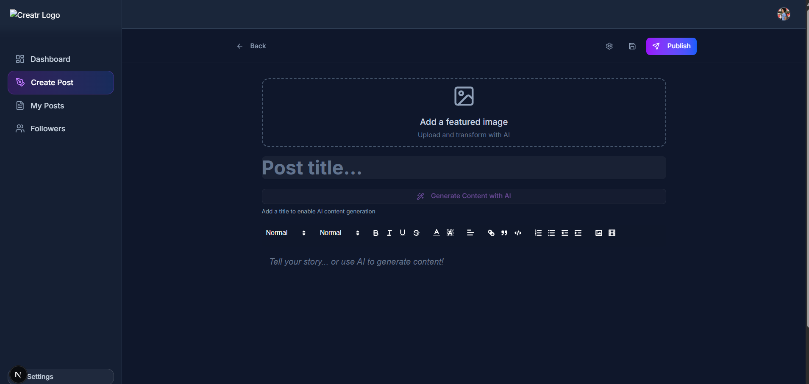

<!-- This is a [Next.js](https://nextjs.org) project bootstrapped with [`create-next-app`](https://github.com/vercel/next.js/tree/canary/packages/create-next-app).

## Getting Started

First, run the development server:

```bash
npm run dev
# or
yarn dev
# or
pnpm dev
# or
bun dev
```

Open [http://localhost:3000](http://localhost:3000) with your browser to see the result.

You can start editing the page by modifying `app/page.js`. The page auto-updates as you edit the file.

This project uses [`next/font`](https://nextjs.org/docs/app/building-your-application/optimizing/fonts) to automatically optimize and load [Geist](https://vercel.com/font), a new font family for Vercel.

## Learn More

To learn more about Next.js, take a look at the following resources:

- [Next.js Documentation](https://nextjs.org/docs) - learn about Next.js features and API.
- [Learn Next.js](https://nextjs.org/learn) - an interactive Next.js tutorial.

You can check out [the Next.js GitHub repository](https://github.com/vercel/next.js) - your feedback and contributions are welcome!

## Deploy on Vercel

The easiest way to deploy your Next.js app is to use the [Vercel Platform](https://vercel.com/new?utm_medium=default-template&filter=next.js&utm_source=create-next-app&utm_campaign=create-next-app-readme) from the creators of Next.js.

Check out our [Next.js deployment documentation](https://nextjs.org/docs/app/building-your-application/deploying) for more details. -->


# EchonetAI


A modern social platform where users can **upload photos**, **share ideas**, and **view analytics** of their activity. Built with a full‑stack Next.js architecture, EchonetAI focuses on simplicity, performance, and clean UI.

---

⭐screenshot

<table>
  <tr>
    <td align="center">
      
      <br /><b>Dashboard</b>
    </td>
    <td align="center">
      
      <br /><b>Features</b>
    </td>
  </tr>

  <tr>
    <td align="center">
      
      <br /><b>Analytics</b>
    </td>
    <td align="center">
      
      <br /><b>Posts</b>
    </td>
  </tr>

  <tr>
    <td align="center">
      
      <br /><b>Work</b>
    </td>
    <td align="center">
      


## 🔗 Live Demo

**Live URL:** [https://echo-net-ai.vercel.app/](https://your-live-demo-link.com)

---

## 🚀 Features

* 📸 **Photo Uploading** – Users can upload and share images.
* 📝 **Idea Sharing** – Post ideas/thoughts with your followers.
* 📊 **Activity Analytics** – Track user engagement and actions.
* 🔐 **Secure Authentication** – Powered by Clerk.
* ⚡ **Real-Time Updates** – Smooth and responsive interactions.
* 🎨 **Modern UI** – Radix UI components & custom styling.
* 📱 **Responsive Design** – Works across mobile and desktop.

---

## 🛠️ Tech Stack

* **Next.js** – Fullstack framework
* **React** – Frontend library
* **Clerk** – Authentication & User Management
* **ConvexDB** – Database ORM
* **PostgreSQL** – Database
* **Radix UI** – Accessible UI components
* **TailwindCSS** – Styling
* **Vercel** – Deployment platform

---

## 📂 Folder Structure

```
/src
  /app
  /components
  /convex
  /lib
  /hooks
  /utils
  /styles
```

---

## ⚙️ Installation & Setup

1. **Clone the repository**

```
git clone <repo-url>
cd echonetai
```

2. **Install dependencies**

```
npm install
```

3. **Create a `.env` file** and add the following:

```
DATABASE_URL=""
NEXT_PUBLIC_CLERK_PUBLISHABLE_KEY=""
CLERK_SECRET_KEY=""
GEMINI_API_KEY=""
NEXT_PUBLIC_IMAGEKIT_URL_ENDPOINT=""
NEXT_PUBLIC_IMAGEKIT_PUBLIC_KEY=""
IMAGEKIT_PRIVATE_KEY=""
```

4. **Run Convex migrations**

```
npx Convex migrate dev
```

5. **Start the development server**

```
npm run dev
```

---

## 🧪 Usage

1. Sign up or log in via Clerk.
2. Upload a photo from your dashboard.
3. Share ideas with your followers.
4. View analytics in the Activity section.

---

## 🤝 Contributing

Pull requests are welcome! For major changes, please open an issue first to discuss what you’d like to change.

--

---

## 💬 Feedback

If you have ideas, features, or improvements, feel free to reach out or open an issue.
